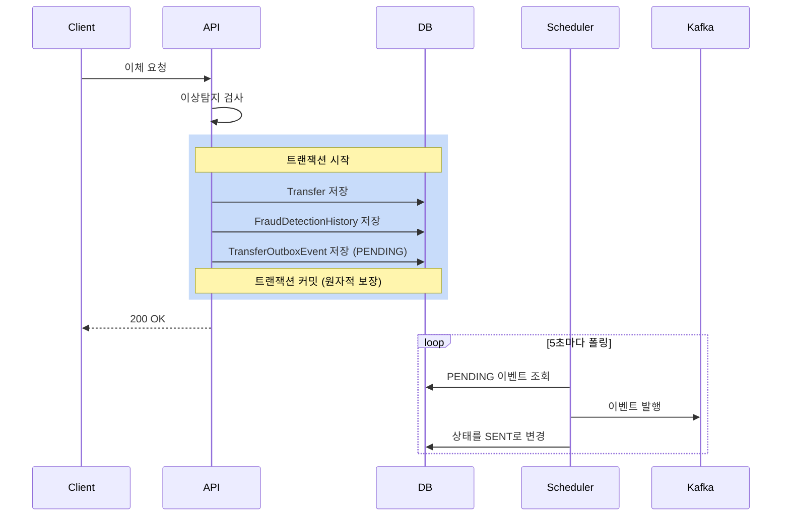
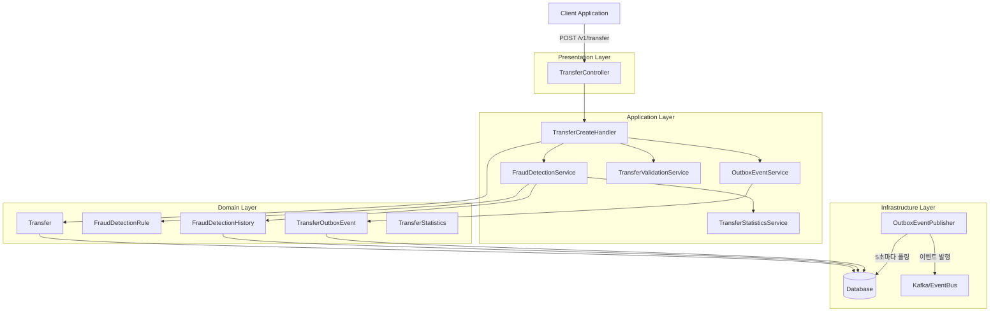
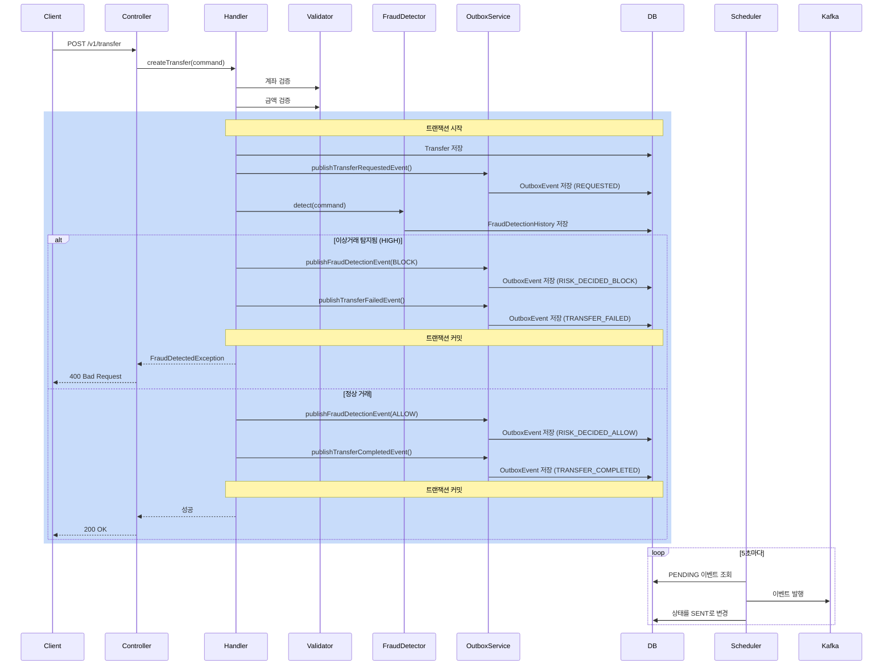
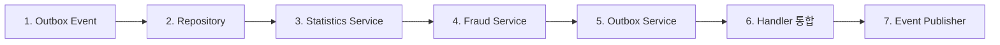

# 이체 이상탐지 시스템 구현 가이드 (Outbox 패턴)

## 목차
1. [개요](#1-개요)
2. [Outbox 패턴](#2-outbox-패턴)
3. [시스템 아키텍처](#3-시스템-아키텍처)
4. [도메인 모델](#4-도메인-모델)
5. [탐지 규칙](#5-탐지-규칙)
6. [구현 가이드](#6-구현-가이드)
7. [이벤트 발행 처리](#7-이벤트-발행-처리)
8. [테스트](#8-테스트)
9. [배포](#9-배포)

---

## 1. 개요

### 1.1 목적
- 실시간으로 이상 거래 패턴 탐지
- 금융 사기 및 비정상적인 이체 차단
- 규칙 기반 탐지 시스템 구축
- **Outbox 패턴을 통한 안정적인 이벤트 발행**

### 1.2 핵심 기능
- **실시간 탐지**: 이체 요청 시점에 즉시 검증
- **다중 규칙 적용**: 금액, 횟수, 속도 기반 탐지
- **위험도 평가**: LOW, MEDIUM, HIGH 3단계 분류
- **이벤트 발행**: Outbox 패턴으로 안정적인 메시지 전달
- **이력 관리**: 탐지 결과 및 조치 이력 저장

### 1.3 현재 프로젝트 상태

#### ✅ 구현 완료 항목
- 도메인 모델: FraudDetectionHistory, FraudActionHistory, FraudDetectionRule, TransferStatistics
- Enum 타입: RuleType, SeverityType, ActionType, DetectionStatusType, TransferEventType
- 기본 이체 로직: TransferCreateHandler
- Outbox 엔티티: TransferOutboxEvent (필드 추가 필요)

#### ❌ 구현 필요 항목
- TransferOutboxEvent 필드 추가 및 메서드
- Repository 레이어 구현
- FraudDetectionService 핵심 로직
- TransferStatisticsService 통계 조회
- OutboxEventService 이벤트 저장
- OutboxEventPublisher 스케줄러
- Handler 통합

---

## 2. Outbox 패턴

### 2.1 왜 Outbox 패턴이 필요한가?

**문제 상황**:
```java
// 잘못된 구현 예시
@Transactional
public void createTransfer(TransferCommand command) {
    Transfer transfer = Transfer.of(command, repo);
    repo.save(transfer);  // DB 저장 성공

    kafkaTemplate.send("topic", event);  // 네트워크 오류로 실패!
    // → DB는 저장되었지만 이벤트는 발행 안됨
}
```

**Outbox 패턴 해결책**:
```java
@Transactional
public void createTransfer(TransferCommand command) {
    Transfer transfer = Transfer.of(command, repo);
    repo.save(transfer);  // 1. DB 저장

    outboxRepo.save(event);  // 2. 같은 트랜잭션에 이벤트 저장
    // → 트랜잭션 커밋: 둘 다 성공하거나 둘 다 실패
}

// 별도 스케줄러가 Outbox 테이블을 폴링하여 발행
```

### 2.2 Outbox 패턴 플로우



### 2.3 이벤트 타입

프로젝트에 정의된 `TransferEventType`:
- `REQUESTED` (TT01): 이체 요청
- `RISK_DECIDED_ALLOW` (TT02): 이상탐지 통과
- `RISK_DECIDED_BLOCK` (TT03): 이상탐지 차단
- `LEDGER_POSTED` (TT04): 원장 반영
- `TRANSFER_COMPLETED` (TT05): 이체 완료
- `TRANSFER_FAILED` (TT06): 이체 실패

---

## 3. 시스템 아키텍처

### 3.1 전체 구조 (Outbox 패턴 포함)



### 3.2 이체 처리 플로우 (Outbox 패턴)



---

## 4. 도메인 모델

### 4.1 핵심 엔티티

#### 4.1.1 TransferOutboxEvent (Outbox 이벤트)

```java
@Entity
@Table(name = "TB_TRANSFER_OUTBOX_EVENT")
public class TransferOutboxEvent {
    @EmbeddedId
    private TransferOutboxEventId id;

    private TransferId transferId;              // 이체 ID

    @Enumerated(EnumType.STRING)
    private TransferEventType eventType;        // 이벤트 타입

    @Column(columnDefinition = "TEXT")
    private String payload;                     // JSON 페이로드

    @Enumerated(EnumType.STRING)
    private EventStatus status;                 // PENDING/SENT/FAILED

    private LocalDateTime createdAt;            // 생성일시
    private LocalDateTime publishedAt;          // 발행일시
    private Integer retryCount;                 // 재시도 횟수
}
```

#### 4.1.2 FraudDetectionRule (탐지 규칙)

```java
@Entity
@Table(name = "TB_FRAUD_RULE")
public class FraudDetectionRule {
    @EmbeddedId
    private FraudDetectionRuleId id;

    private String name;                        // 룰 이름
    private RuleType type;                      // AMOUNT/COUNT/VELOCITY
    private Long threshold;                     // 임계값

    @Embedded
    private ThresholdRange range;               // 구간 (시작, 종료)

    private SeverityType severityType;          // LOW/MEDIUM/HIGH

    @Column(name = "USE_FLAG")
    private boolean enabled;                    // 활성 여부
}
```

#### 4.1.3 FraudDetectionHistory (탐지 이력)

```java
@Entity
@Table(name = "TB_FRAUD_DETECTION_HISTORY")
public class FraudDetectionHistory {
    @EmbeddedId
    private FraudDetectionHistoryId id;

    private TransferHistoryId transferHistoryId;  // 이체 이력 ID
    private FraudDetectionRuleId ruleId;          // 적용된 룰 ID
    private AccountId accountId;                  // 대상 계좌 ID
    private LocalDateTime detectedAt;             // 탐지 일시
    private Long actualValue;                     // 실제 값
    private Long threshold;                       // 기준 값
    private SeverityType severityType;            // 위험도
}
```

### 4.2 Enum 타입

#### 4.2.1 EventStatus (이벤트 상태)

```java
public enum EventStatus {
    PENDING("ES01", "발행대기"),
    SENT("ES02", "발행완료"),
    FAILED("ES03", "발행실패");
}
```

#### 4.2.2 RuleType (탐지 규칙 유형)

```java
public enum RuleType {
    AMOUNT("RT01", "금액"),      // 금액 기반 탐지
    COUNT("RT02", "횟수"),       // 횟수 기반 탐지
    VELOCITY("RT03", "속도");    // 속도 기반 탐지
}
```

#### 4.2.3 SeverityType (위험도)

```java
public enum SeverityType {
    LOW("ST01", "낮음"),         // 모니터링만 수행
    MEDIUM("ST02", "보통"),      // 경고 알림
    HIGH("ST03", "높음");        // 즉시 차단
}
```

---

## 5. 탐지 규칙

### 5.1 금액 기반 탐지 (AMOUNT)

**목적**: 비정상적으로 큰 금액의 이체 탐지

**규칙 예시**:
| 규칙명 | 조건 | 임계값 | 위험도 |
|--------|------|--------|--------|
| 고액 이체 | 1회 이체 금액 | 10,000,000원 | HIGH |
| 중액 이체 | 1회 이체 금액 | 5,000,000원 | MEDIUM |
| 일일 누적 | 일일 총 이체 금액 | 20,000,000원 | HIGH |

**구현 로직**:
```java
private FraudDetection applyAmountRule(TransferCommand command, FraudDetectionRule rule) {
    long amount = command.amount();

    // 단일 이체 금액 검사
    if (amount >= rule.getThreshold()) {
        return FraudDetection.detected(rule, amount, rule.getThreshold());
    }

    // 일일 누적 금액 검사 (range가 있는 경우)
    if (rule.getRange() != null) {
        long totalAmount = statisticsService.getTotalAmount(
            command.fromAccountId(),
            LocalDateTime.now().minusDays(1),
            LocalDateTime.now()
        );
        long totalWithCurrent = totalAmount + amount;

        if (totalWithCurrent >= rule.getThreshold()) {
            return FraudDetection.detected(rule, totalWithCurrent, rule.getThreshold());
        }
    }

    return FraudDetection.notDetected();
}
```

### 5.2 횟수 기반 탐지 (COUNT)

**목적**: 짧은 시간에 반복되는 이체 탐지

**규칙 예시**:
| 규칙명 | 조건 | 임계값 | 구간 | 위험도 |
|--------|------|--------|------|--------|
| 단시간 반복 이체 | 10분 내 이체 횟수 | 5회 | 10분 | HIGH |
| 시간당 이체 | 1시간 내 이체 횟수 | 20회 | 1시간 | MEDIUM |
| 일일 이체 | 일일 이체 횟수 | 50회 | 1일 | LOW |

**구현 로직**:
```java
private FraudDetection applyCountRule(TransferCommand command, FraudDetectionRule rule) {
    ThresholdRange range = rule.getRange();
    long minutes = range.getMin(); // 10, 60, 1440(1일)

    LocalDateTime start = LocalDateTime.now().minusMinutes(minutes);
    long count = statisticsService.countTransfers(
        command.fromAccountId(),
        start,
        LocalDateTime.now()
    );

    // 현재 이체 포함
    long countWithCurrent = count + 1;

    if (countWithCurrent >= rule.getThreshold()) {
        return FraudDetection.detected(rule, countWithCurrent, rule.getThreshold());
    }

    return FraudDetection.notDetected();
}
```

### 5.3 속도 기반 탐지 (VELOCITY)

**목적**: 급격한 이체 패턴 변화 탐지

**규칙 예시**:
| 규칙명 | 조건 | 임계값 | 위험도 |
|--------|------|--------|--------|
| 평균 대비 급증 | 평균 대비 증가율 | 300% | HIGH |
| 신규 계좌 과다 이체 | 계좌 생성 7일 이내 | 10회 | MEDIUM |

**구현 로직**:
```java
private FraudDetection applyVelocityRule(TransferCommand command, FraudDetectionRule rule) {
    // 최근 30일 평균 금액 계산
    double avgAmount = statisticsService.getAverageAmount(
        command.fromAccountId(),
        Duration.ofDays(30)
    );

    if (avgAmount == 0) {
        return FraudDetection.notDetected(); // 신규 계좌
    }

    // 평균 대비 비율 계산 (%)
    double ratio = (command.amount() / avgAmount) * 100;

    if ((long)ratio >= rule.getThreshold()) {
        return FraudDetection.detected(rule, (long)ratio, rule.getThreshold());
    }

    return FraudDetection.notDetected();
}
```

---

## 6. 구현 가이드

### 6.1 구현 순서



| 단계 | 작업 | 우선순위 |
|------|------|----------|
| 1 | TransferOutboxEvent 필드 추가 | HIGH |
| 2 | Repository 레이어 구현 | HIGH |
| 3 | TransferStatisticsService | HIGH |
| 4 | FraudDetectionService | HIGH |
| 5 | OutboxEventService | HIGH |
| 6 | TransferCreateHandler 통합 | HIGH |
| 7 | OutboxEventPublisher 스케줄러 | HIGH |

---

### 6.2 단계 1: TransferOutboxEvent 필드 추가

#### EventStatus Enum

**위치**: `src/main/java/project/transferapi/domain/event/EventStatus.java`

```java
package project.transferapi.domain.event;

import project.transferapi.domain.Code;

public enum EventStatus implements Code {
    PENDING("ES01", "발행대기"),
    SENT("ES02", "발행완료"),
    FAILED("ES03", "발행실패");

    private final String code;
    private final String name;

    EventStatus(String code, String name) {
        this.code = code;
        this.name = name;
    }

    @Override
    public String getCode() {
        return this.code;
    }

    @Override
    public String getName() {
        return this.name;
    }
}
```

#### TransferOutboxEvent 완성

**위치**: `src/main/java/project/transferapi/domain/event/TransferOutboxEvent.java`

```java
package project.transferapi.domain.event;

import jakarta.persistence.*;
import lombok.AccessLevel;
import lombok.AllArgsConstructor;
import lombok.Getter;
import lombok.NoArgsConstructor;
import project.transferapi.domain.transfer.TransferId;
import project.transferapi.domain.transfer.TransferEventType;

import java.time.LocalDateTime;

@Entity
@Table(name = "TB_TRANSFER_OUTBOX_EVENT")
@NoArgsConstructor(access = AccessLevel.PROTECTED)
@AllArgsConstructor(access = AccessLevel.PROTECTED)
@Getter
public class TransferOutboxEvent {
    @EmbeddedId
    private TransferOutboxEventId id;

    private TransferId transferId;

    @Enumerated(EnumType.STRING)
    private TransferEventType eventType;

    @Column(columnDefinition = "TEXT")
    private String payload;

    @Enumerated(EnumType.STRING)
    private EventStatus status;

    @Column(name = "CREATED_AT")
    private LocalDateTime createdAt;

    @Column(name = "PUBLISHED_AT")
    private LocalDateTime publishedAt;

    @Column(name = "RETRY_COUNT")
    private Integer retryCount;

    /**
     * Outbox 이벤트 생성
     */
    public static TransferOutboxEvent create(
        TransferOutboxEventId id,
        TransferId transferId,
        TransferEventType eventType,
        String payload
    ) {
        return new TransferOutboxEvent(
            id,
            transferId,
            eventType,
            payload,
            EventStatus.PENDING,
            LocalDateTime.now(),
            null,
            0
        );
    }

    /**
     * 발행 완료 처리
     */
    public void markAsSent() {
        this.status = EventStatus.SENT;
        this.publishedAt = LocalDateTime.now();
    }

    /**
     * 발행 실패 처리
     */
    public void markAsFailed() {
        this.status = EventStatus.FAILED;
        this.retryCount++;
    }

    /**
     * 재시도 가능 여부
     */
    public boolean canRetry() {
        return this.retryCount < 3;
    }
}
```

---

### 6.3 단계 2: Repository 레이어

#### TransferOutboxEventRepository

**위치**: `src/main/java/project/transferapi/domain/event/TransferOutboxEventRepository.java`

```java
package project.transferapi.domain.event;

import java.util.List;

public interface TransferOutboxEventRepository {
    TransferOutboxEvent save(TransferOutboxEvent event);
    List<TransferOutboxEvent> findByStatusOrderByCreatedAtAsc(EventStatus status);
    List<TransferOutboxEvent> findRetryableFailedEvents();
    TransferOutboxEventId nextId();
}
```

#### TransferOutboxEventJPARepository

**위치**: `src/main/java/project/transferapi/infra/event/TransferOutboxEventJPARepository.java`

```java
package project.transferapi.infra.event;

import org.springframework.data.jpa.repository.JpaRepository;
import org.springframework.data.jpa.repository.Query;
import project.transferapi.domain.event.*;

import java.util.List;

public interface TransferOutboxEventJPARepository
    extends JpaRepository<TransferOutboxEvent, TransferOutboxEventId> {

    List<TransferOutboxEvent> findByStatusOrderByCreatedAtAsc(EventStatus status);

    @Query("SELECT e FROM TransferOutboxEvent e " +
           "WHERE e.status = 'FAILED' AND e.retryCount < 3 " +
           "ORDER BY e.createdAt ASC")
    List<TransferOutboxEvent> findRetryableFailedEvents();
}
```

#### DefaultTransferOutboxEventRepository

**위치**: `src/main/java/project/transferapi/infra/event/DefaultTransferOutboxEventRepository.java`

```java
package project.transferapi.infra.event;

import lombok.RequiredArgsConstructor;
import org.springframework.stereotype.Repository;
import project.transferapi.domain.event.*;

import java.util.List;
import java.util.concurrent.atomic.AtomicLong;

@Repository
@RequiredArgsConstructor
public class DefaultTransferOutboxEventRepository implements TransferOutboxEventRepository {

    private final TransferOutboxEventJPARepository jpaRepository;
    private final AtomicLong idGenerator = new AtomicLong(System.currentTimeMillis());

    @Override
    public TransferOutboxEvent save(TransferOutboxEvent event) {
        return jpaRepository.save(event);
    }

    @Override
    public List<TransferOutboxEvent> findByStatusOrderByCreatedAtAsc(EventStatus status) {
        return jpaRepository.findByStatusOrderByCreatedAtAsc(status);
    }

    @Override
    public List<TransferOutboxEvent> findRetryableFailedEvents() {
        return jpaRepository.findRetryableFailedEvents();
    }

    @Override
    public TransferOutboxEventId nextId() {
        return TransferOutboxEventId.of(idGenerator.incrementAndGet());
    }
}
```

#### FraudDetectionRuleRepository & 기타

**위치**: `src/main/java/project/transferapi/domain/fraud/rule/FraudDetectionRuleRepository.java`

```java
package project.transferapi.domain.fraud.rule;

import java.util.List;
import java.util.Optional;

public interface FraudDetectionRuleRepository {
    Optional<FraudDetectionRule> findById(FraudDetectionRuleId id);
    List<FraudDetectionRule> findAllByEnabledTrue();
    FraudDetectionRule save(FraudDetectionRule rule);
    FraudDetectionRuleId nextId();
}
```

**위치**: `src/main/java/project/transferapi/domain/fraud/FraudDetectionHistoryRepository.java`

```java
package project.transferapi.domain.fraud;

import project.transferapi.domain.account.AccountId;
import java.time.LocalDateTime;
import java.util.List;

public interface FraudDetectionHistoryRepository {
    FraudDetectionHistory save(FraudDetectionHistory history);
    List<FraudDetectionHistory> findByAccountIdAndDetectedAtAfter(
        AccountId accountId, LocalDateTime after
    );
    FraudDetectionHistoryId nextId();
}
```

**TransferRepository 확장**:

```java
// 기존 메서드에 추가
long countByFromAccountIdAndRequestedAtBetween(
    AccountId accountId, LocalDateTime start, LocalDateTime end
);

Double getAverageAmountByFromAccountId(
    AccountId accountId, LocalDateTime start, LocalDateTime end
);

Long getTotalAmountByFromAccountId(
    AccountId accountId, LocalDateTime start, LocalDateTime end
);
```

---

### 6.4 단계 3: TransferStatisticsService

**위치**: `src/main/java/project/transferapi/application/stat/TransferStatisticsService.java`

```java
package project.transferapi.application.stat;

import lombok.RequiredArgsConstructor;
import lombok.extern.slf4j.Slf4j;
import org.springframework.stereotype.Service;
import project.transferapi.domain.account.AccountId;
import project.transferapi.domain.transfer.TransferRepository;

import java.time.Duration;
import java.time.LocalDateTime;

@Slf4j
@Service
@RequiredArgsConstructor
public class TransferStatisticsService {

    private final TransferRepository transferRepository;

    /**
     * 특정 기간 내 이체 횟수 조회
     */
    public long countTransfers(AccountId accountId, LocalDateTime start, LocalDateTime end) {
        return transferRepository.countByFromAccountIdAndRequestedAtBetween(
            accountId, start, end
        );
    }

    /**
     * 최근 N일 평균 이체 금액 조회
     */
    public double getAverageAmount(AccountId accountId, Duration period) {
        LocalDateTime start = LocalDateTime.now().minus(period);
        LocalDateTime end = LocalDateTime.now();

        Double avg = transferRepository.getAverageAmountByFromAccountId(
            accountId, start, end
        );

        return avg != null ? avg : 0.0;
    }

    /**
     * 특정 기간 내 총 이체 금액 조회
     */
    public long getTotalAmount(AccountId accountId, LocalDateTime start, LocalDateTime end) {
        Long total = transferRepository.getTotalAmountByFromAccountId(
            accountId, start, end
        );

        return total != null ? total : 0L;
    }
}
```

---

### 6.5 단계 4: FraudDetectionService

#### FraudDetection (Value Object)

**위치**: `src/main/java/project/transferapi/application/fraud/FraudDetection.java`

```java
package project.transferapi.application.fraud;

import lombok.AccessLevel;
import lombok.AllArgsConstructor;
import lombok.Getter;
import project.transferapi.domain.fraud.SeverityType;
import project.transferapi.domain.fraud.rule.FraudDetectionRule;

@Getter
@AllArgsConstructor(access = AccessLevel.PRIVATE)
public class FraudDetection {
    private final boolean detected;
    private final FraudDetectionRule rule;
    private final long actualValue;
    private final long threshold;
    private final SeverityType severity;

    public static FraudDetection detected(
        FraudDetectionRule rule, long actualValue, long threshold
    ) {
        return new FraudDetection(
            true, rule, actualValue, threshold, rule.getSeverityType()
        );
    }

    public static FraudDetection notDetected() {
        return new FraudDetection(false, null, 0, 0, null);
    }
}
```

#### FraudDetectionResult

**위치**: `src/main/java/project/transferapi/application/fraud/FraudDetectionResult.java`

```java
package project.transferapi.application.fraud;

import lombok.AccessLevel;
import lombok.AllArgsConstructor;
import lombok.Getter;
import project.transferapi.domain.fraud.SeverityType;

import java.util.Comparator;
import java.util.List;

@Getter
@AllArgsConstructor(access = AccessLevel.PRIVATE)
public class FraudDetectionResult {
    private final List<FraudDetection> detections;
    private final SeverityType maxSeverity;
    private final boolean blocked;

    public static FraudDetectionResult of(List<FraudDetection> detections) {
        SeverityType maxSeverity = detections.stream()
            .map(FraudDetection::getSeverity)
            .max(Comparator.comparing(SeverityType::getCode))
            .orElse(null);

        boolean blocked = maxSeverity == SeverityType.HIGH;

        return new FraudDetectionResult(detections, maxSeverity, blocked);
    }

    public static FraudDetectionResult noDetection() {
        return new FraudDetectionResult(List.of(), null, false);
    }

    public boolean hasDetection() {
        return !detections.isEmpty();
    }
}
```

#### FraudDetectionService

**위치**: `src/main/java/project/transferapi/application/fraud/FraudDetectionService.java`

```java
package project.transferapi.application.fraud;

import lombok.RequiredArgsConstructor;
import lombok.extern.slf4j.Slf4j;
import org.springframework.stereotype.Service;
import org.springframework.transaction.annotation.Transactional;
import project.transferapi.application.stat.TransferStatisticsService;
import project.transferapi.application.transfer.TransferCommand;
import project.transferapi.domain.fraud.*;
import project.transferapi.domain.fraud.rule.*;

import java.time.Duration;
import java.time.LocalDateTime;
import java.util.ArrayList;
import java.util.List;

@Slf4j
@Service
@RequiredArgsConstructor
public class FraudDetectionService {

    private final FraudDetectionRuleRepository ruleRepository;
    private final FraudDetectionHistoryRepository historyRepository;
    private final TransferStatisticsService statisticsService;

    /**
     * 이체 요청에 대한 이상거래 탐지
     */
    @Transactional
    public FraudDetectionResult detect(TransferCommand command) {
        log.info("Starting fraud detection: from={}, amount={}",
            command.fromAccountId().getValue(), command.amount());

        // 1. 활성화된 룰 조회
        List<FraudDetectionRule> rules = ruleRepository.findAllByEnabledTrue();

        // 2. 각 룰 적용
        List<FraudDetection> detections = new ArrayList<>();
        for (FraudDetectionRule rule : rules) {
            FraudDetection detection = applyRule(command, rule);
            if (detection.isDetected()) {
                log.warn("Fraud detected: rule={}, actual={}, threshold={}",
                    rule.getName(), detection.getActualValue(), detection.getThreshold());
                detections.add(detection);
            }
        }

        // 3. 결과 생성
        FraudDetectionResult result = detections.isEmpty()
            ? FraudDetectionResult.noDetection()
            : FraudDetectionResult.of(detections);

        // 4. 탐지 이력 저장
        if (result.hasDetection()) {
            saveDetectionHistory(command, detections);
        }

        log.info("Fraud detection completed: detected={}, blocked={}",
            result.hasDetection(), result.isBlocked());

        return result;
    }

    private FraudDetection applyRule(TransferCommand command, FraudDetectionRule rule) {
        return switch (rule.getType()) {
            case AMOUNT -> applyAmountRule(command, rule);
            case COUNT -> applyCountRule(command, rule);
            case VELOCITY -> applyVelocityRule(command, rule);
        };
    }

    private FraudDetection applyAmountRule(TransferCommand command, FraudDetectionRule rule) {
        long amount = command.amount();
        ThresholdRange range = rule.getRange();

        if (range != null && range.getMin() != null) {
            LocalDateTime start = LocalDateTime.now().minusDays(1);
            long totalAmount = statisticsService.getTotalAmount(
                command.fromAccountId(), start, LocalDateTime.now()
            );
            long totalWithCurrent = totalAmount + amount;

            if (totalWithCurrent >= rule.getThreshold()) {
                return FraudDetection.detected(rule, totalWithCurrent, rule.getThreshold());
            }
        } else {
            if (amount >= rule.getThreshold()) {
                return FraudDetection.detected(rule, amount, rule.getThreshold());
            }
        }

        return FraudDetection.notDetected();
    }

    private FraudDetection applyCountRule(TransferCommand command, FraudDetectionRule rule) {
        ThresholdRange range = rule.getRange();
        if (range == null || range.getMin() == null) {
            return FraudDetection.notDetected();
        }

        long minutes = range.getMin();
        LocalDateTime start = LocalDateTime.now().minusMinutes(minutes);
        long count = statisticsService.countTransfers(
            command.fromAccountId(), start, LocalDateTime.now()
        );
        long countWithCurrent = count + 1;

        if (countWithCurrent >= rule.getThreshold()) {
            return FraudDetection.detected(rule, countWithCurrent, rule.getThreshold());
        }

        return FraudDetection.notDetected();
    }

    private FraudDetection applyVelocityRule(TransferCommand command, FraudDetectionRule rule) {
        double avgAmount = statisticsService.getAverageAmount(
            command.fromAccountId(), Duration.ofDays(30)
        );

        if (avgAmount == 0) {
            return FraudDetection.notDetected();
        }

        double ratio = (command.amount() / avgAmount) * 100;

        if ((long)ratio >= rule.getThreshold()) {
            return FraudDetection.detected(rule, (long)ratio, rule.getThreshold());
        }

        return FraudDetection.notDetected();
    }

    private void saveDetectionHistory(TransferCommand command, List<FraudDetection> detections) {
        for (FraudDetection detection : detections) {
            FraudDetectionHistory history = FraudDetectionHistory.of(
                historyRepository.nextId(),
                null,
                detection.getRule().getId(),
                command.fromAccountId(),
                LocalDateTime.now(),
                detection.getActualValue(),
                detection.getThreshold(),
                detection.getSeverity()
            );
            historyRepository.save(history);
        }
    }
}
```

**FraudDetectionHistory에 of() 메서드 추가**:

```java
// FraudDetectionHistory.java
public static FraudDetectionHistory of(
    FraudDetectionHistoryId id,
    TransferHistoryId transferHistoryId,
    FraudDetectionRuleId ruleId,
    AccountId accountId,
    LocalDateTime detectedAt,
    Long actualValue,
    Long threshold,
    SeverityType severityType
) {
    return new FraudDetectionHistory(
        id, transferHistoryId, ruleId, accountId,
        detectedAt, actualValue, threshold, severityType
    );
}
```

#### FraudDetectedException

**위치**: `src/main/java/project/transferapi/application/fraud/FraudDetectedException.java`

```java
package project.transferapi.application.fraud;

import project.transferapi.application.ApplicationException;
import project.transferapi.application.ErrorStatus;

public class FraudDetectedException extends ApplicationException {
    private final FraudDetectionResult detectionResult;

    public FraudDetectedException(ErrorStatus errorStatus, FraudDetectionResult result) {
        super(errorStatus);
        this.detectionResult = result;
    }

    public FraudDetectionResult getDetectionResult() {
        return detectionResult;
    }
}
```

**ErrorStatus에 추가**:

```java
// ErrorStatus.java
FRAUD_HIGH_RISK("FD002", "고위험 거래로 차단되었습니다"),
```

---

### 6.6 단계 5: OutboxEventService

#### ObjectMapper 설정

**위치**: `src/main/java/project/transferapi/infra/config/JacksonConfig.java`

```java
package project.transferapi.infra.config;

import com.fasterxml.jackson.databind.ObjectMapper;
import com.fasterxml.jackson.databind.SerializationFeature;
import com.fasterxml.jackson.datatype.jsr310.JavaTimeModule;
import org.springframework.context.annotation.Bean;
import org.springframework.context.annotation.Configuration;

@Configuration
public class JacksonConfig {

    @Bean
    public ObjectMapper objectMapper() {
        ObjectMapper mapper = new ObjectMapper();
        mapper.registerModule(new JavaTimeModule());
        mapper.disable(SerializationFeature.WRITE_DATES_AS_TIMESTAMPS);
        return mapper;
    }
}
```

#### OutboxEventService

**위치**: `src/main/java/project/transferapi/application/event/OutboxEventService.java`

```java
package project.transferapi.application.event;

import com.fasterxml.jackson.core.JsonProcessingException;
import com.fasterxml.jackson.databind.ObjectMapper;
import lombok.RequiredArgsConstructor;
import lombok.extern.slf4j.Slf4j;
import org.springframework.stereotype.Service;
import org.springframework.transaction.annotation.Transactional;
import project.transferapi.application.fraud.FraudDetectionResult;
import project.transferapi.domain.event.TransferOutboxEvent;
import project.transferapi.domain.event.TransferOutboxEventRepository;
import project.transferapi.domain.transfer.TransferId;
import project.transferapi.domain.transfer.TransferEventType;

import java.util.HashMap;
import java.util.Map;

@Slf4j
@Service
@RequiredArgsConstructor
public class OutboxEventService {

    private final TransferOutboxEventRepository outboxRepository;
    private final ObjectMapper objectMapper;

    /**
     * 이체 요청 이벤트 발행 (Outbox에 저장)
     */
    @Transactional
    public void publishTransferRequestedEvent(TransferId transferId, Long amount) {
        Map<String, Object> payload = new HashMap<>();
        payload.put("transferId", transferId.getValue());
        payload.put("amount", amount);
        payload.put("eventType", "TRANSFER_REQUESTED");

        saveOutboxEvent(transferId, TransferEventType.REQUESTED, payload);
        log.info("Transfer requested event saved: transferId={}", transferId.getValue());
    }

    /**
     * 이상탐지 완료 이벤트 발행 (Outbox에 저장)
     */
    @Transactional
    public void publishFraudDetectionEvent(TransferId transferId, FraudDetectionResult result) {
        Map<String, Object> payload = new HashMap<>();
        payload.put("transferId", transferId.getValue());
        payload.put("detected", result.hasDetection());
        payload.put("blocked", result.isBlocked());
        payload.put("maxSeverity", result.getMaxSeverity() != null
            ? result.getMaxSeverity().name() : null);
        payload.put("detectionCount", result.getDetections().size());

        TransferEventType eventType = result.isBlocked()
            ? TransferEventType.RISK_DECIDED_BLOCK
            : TransferEventType.RISK_DECIDED_ALLOW;

        saveOutboxEvent(transferId, eventType, payload);
        log.info("Fraud detection event saved: transferId={}, blocked={}",
            transferId.getValue(), result.isBlocked());
    }

    /**
     * 이체 완료 이벤트 발행 (Outbox에 저장)
     */
    @Transactional
    public void publishTransferCompletedEvent(TransferId transferId) {
        Map<String, Object> payload = new HashMap<>();
        payload.put("transferId", transferId.getValue());
        payload.put("eventType", "TRANSFER_COMPLETED");

        saveOutboxEvent(transferId, TransferEventType.TRANSFER_COMPLETED, payload);
        log.info("Transfer completed event saved: transferId={}", transferId.getValue());
    }

    /**
     * 이체 실패 이벤트 발행 (Outbox에 저장)
     */
    @Transactional
    public void publishTransferFailedEvent(TransferId transferId, String reason) {
        Map<String, Object> payload = new HashMap<>();
        payload.put("transferId", transferId.getValue());
        payload.put("failureReason", reason);
        payload.put("eventType", "TRANSFER_FAILED");

        saveOutboxEvent(transferId, TransferEventType.TRANSFER_FAILED, payload);
        log.info("Transfer failed event saved: transferId={}", transferId.getValue());
    }

    /**
     * Outbox에 이벤트 저장 (공통)
     */
    private void saveOutboxEvent(
        TransferId transferId,
        TransferEventType eventType,
        Map<String, Object> payload
    ) {
        try {
            String payloadJson = objectMapper.writeValueAsString(payload);

            TransferOutboxEvent event = TransferOutboxEvent.create(
                outboxRepository.nextId(),
                transferId,
                eventType,
                payloadJson
            );

            outboxRepository.save(event);
        } catch (JsonProcessingException e) {
            log.error("Failed to serialize event payload", e);
            throw new RuntimeException("Failed to create outbox event", e);
        }
    }
}
```

---

### 6.7 단계 6: TransferCreateHandler 통합

**위치**: `src/main/java/project/transferapi/application/transfer/TransferCreateHandler.java:24`

```java
package project.transferapi.application.transfer;

import jakarta.transaction.Transactional;
import lombok.RequiredArgsConstructor;
import lombok.extern.slf4j.Slf4j;
import org.springframework.stereotype.Component;
import project.transferapi.application.ErrorStatus;
import project.transferapi.application.event.OutboxEventService;
import project.transferapi.application.fraud.FraudDetectedException;
import project.transferapi.application.fraud.FraudDetectionResult;
import project.transferapi.application.fraud.FraudDetectionService;
import project.transferapi.domain.account.AccountValidationService;
import project.transferapi.domain.fraud.SeverityType;
import project.transferapi.domain.transfer.Transfer;
import project.transferapi.domain.transfer.TransferRepository;
import project.transferapi.domain.transfer.TransferValidationService;

@Slf4j
@Component
@Transactional
@RequiredArgsConstructor
public class TransferCreateHandler {
    private final TransferRepository repo;
    private final TransferValidationService validationService;
    private final AccountValidationService accountValidationService;
    private final FraudDetectionService fraudDetectionService;
    private final OutboxEventService outboxEventService;

    /**
     * 이체 요청 (이상탐지 + Outbox 패턴)
     */
    public void createTransfer(TransferCommand command) {
        log.info("Transfer request: from={}, to={}, amount={}",
            command.fromAccountId(), command.toAccountId(), command.amount());

        try {
            // 1. 기본 검증
            accountValidationService.validAccountInfo(command.fromAccountId());
            accountValidationService.validAccountInfo(command.toAccountId());
            validationService.validTransferAmount(command.fromAccountId(), command.amount());

            // 2. 이체 생성
            Transfer transfer = Transfer.of(command, repo);
            log.info("Transfer created: id={}", transfer.getId());

            // 3. 이체 요청 이벤트 발행 (Outbox)
            outboxEventService.publishTransferRequestedEvent(
                transfer.getId(), transfer.getAmount()
            );

            // 4. 이상거래 탐지
            FraudDetectionResult fraudResult = fraudDetectionService.detect(command);

            // 5. 이상탐지 결과 이벤트 발행 (Outbox)
            outboxEventService.publishFraudDetectionEvent(transfer.getId(), fraudResult);

            // 6. 위험도에 따른 처리
            if (fraudResult.isBlocked()) {
                log.warn("Transfer blocked: id={}, severity={}",
                    transfer.getId(), fraudResult.getMaxSeverity());

                // 실패 이벤트 발행
                outboxEventService.publishTransferFailedEvent(
                    transfer.getId(), "FRAUD_BLOCKED"
                );

                throw new FraudDetectedException(ErrorStatus.FRAUD_HIGH_RISK, fraudResult);
            }

            // 7. 이체 완료 이벤트 발행 (Outbox)
            outboxEventService.publishTransferCompletedEvent(transfer.getId());

            // 8. MEDIUM 위험도 경고
            if (fraudResult.hasDetection() &&
                fraudResult.getMaxSeverity() == SeverityType.MEDIUM) {
                log.warn("Transfer completed but monitored: id={}", transfer.getId());
            }

            log.info("Transfer completed: id={}", transfer.getId());

        } catch (FraudDetectedException e) {
            log.error("Transfer failed due to fraud", e);
            throw e;
        }
    }
}
```

---

## 7. 이벤트 발행 처리

### 7.1 EventMessagePublisher 인터페이스

**위치**: `src/main/java/project/transferapi/application/event/EventMessagePublisher.java`

```java
package project.transferapi.application.event;

import project.transferapi.domain.event.TransferOutboxEvent;

/**
 * 실제 메시지 발행을 담당하는 인터페이스
 */
public interface EventMessagePublisher {
    void publish(TransferOutboxEvent event) throws Exception;
}
```

### 7.2 LoggingEventMessagePublisher (테스트용)

**위치**: `src/main/java/project/transferapi/infra/event/LoggingEventMessagePublisher.java`

```java
package project.transferapi.infra.event;

import lombok.extern.slf4j.Slf4j;
import org.springframework.stereotype.Component;
import project.transferapi.application.event.EventMessagePublisher;
import project.transferapi.domain.event.TransferOutboxEvent;

@Slf4j
@Component
public class LoggingEventMessagePublisher implements EventMessagePublisher {

    @Override
    public void publish(TransferOutboxEvent event) {
        log.info("📨 Event Published: id={}, type={}, transferId={}, payload={}",
            event.getId(),
            event.getEventType(),
            event.getTransferId(),
            event.getPayload()
        );
    }
}
```

### 7.3 OutboxEventPublisher (스케줄러)

**위치**: `src/main/java/project/transferapi/application/event/OutboxEventPublisher.java`

```java
package project.transferapi.application.event;

import lombok.RequiredArgsConstructor;
import lombok.extern.slf4j.Slf4j;
import org.springframework.scheduling.annotation.Scheduled;
import org.springframework.stereotype.Component;
import org.springframework.transaction.annotation.Transactional;
import project.transferapi.domain.event.EventStatus;
import project.transferapi.domain.event.TransferOutboxEvent;
import project.transferapi.domain.event.TransferOutboxEventRepository;

import java.util.List;

@Slf4j
@Component
@RequiredArgsConstructor
public class OutboxEventPublisher {

    private final TransferOutboxEventRepository outboxRepository;
    private final EventMessagePublisher messagePublisher;

    /**
     * 5초마다 PENDING 이벤트 발행
     */
    @Scheduled(fixedDelay = 5000)
    @Transactional
    public void publishPendingEvents() {
        List<TransferOutboxEvent> events = outboxRepository
            .findByStatusOrderByCreatedAtAsc(EventStatus.PENDING);

        if (events.isEmpty()) {
            return;
        }

        log.info("Publishing {} pending events", events.size());

        for (TransferOutboxEvent event : events) {
            try {
                messagePublisher.publish(event);
                event.markAsSent();
                outboxRepository.save(event);

                log.info("Event published: id={}, type={}",
                    event.getId(), event.getEventType());

            } catch (Exception e) {
                log.error("Event publish failed: id={}", event.getId(), e);
                event.markAsFailed();
                outboxRepository.save(event);
            }
        }
    }

    /**
     * 1분마다 실패 이벤트 재시도
     */
    @Scheduled(fixedDelay = 60000)
    @Transactional
    public void retryFailedEvents() {
        List<TransferOutboxEvent> events = outboxRepository.findRetryableFailedEvents();

        if (events.isEmpty()) {
            return;
        }

        log.info("Retrying {} failed events", events.size());

        for (TransferOutboxEvent event : events) {
            if (!event.canRetry()) {
                log.warn("Max retry exceeded: id={}", event.getId());
                continue;
            }

            try {
                messagePublisher.publish(event);
                event.markAsSent();
                outboxRepository.save(event);

            } catch (Exception e) {
                log.error("Retry failed: id={}", event.getId(), e);
                event.markAsFailed();
                outboxRepository.save(event);
            }
        }
    }
}
```

### 7.4 스케줄링 활성화

**위치**: `src/main/java/project/transferapi/TransferApiApplication.java`

```java
package project.transferapi;

import org.springframework.boot.SpringApplication;
import org.springframework.boot.autoconfigure.SpringBootApplication;
import org.springframework.scheduling.annotation.EnableScheduling;

@SpringBootApplication
@EnableScheduling  // 추가
public class TransferApiApplication {
    public static void main(String[] args) {
        SpringApplication.run(TransferApiApplication.class, args);
    }
}
```

---

## 8. 테스트

### 8.1 단위 테스트

#### FraudDetectionService 테스트

```java
@ExtendWith(MockitoExtension.class)
class FraudDetectionServiceTest {

    @Mock
    private FraudDetectionRuleRepository ruleRepository;
    @Mock
    private FraudDetectionHistoryRepository historyRepository;
    @Mock
    private TransferStatisticsService statisticsService;

    @InjectMocks
    private FraudDetectionService fraudDetectionService;

    @Test
    @DisplayName("고액 이체 탐지")
    void detectHighAmountTransfer() {
        // Given
        TransferCommand command = new TransferCommand(
            new AccountId("ACC001"), new AccountId("ACC002"),
            15_000_000L, null, null, LocalDateTime.now(), null
        );

        FraudDetectionRule rule = new FraudDetectionRule(
            new FraudDetectionRuleId("RULE001"),
            "고액이체", RuleType.AMOUNT, 10_000_000L,
            null, SeverityType.HIGH, true
        );

        given(ruleRepository.findAllByEnabledTrue()).willReturn(List.of(rule));

        // When
        FraudDetectionResult result = fraudDetectionService.detect(command);

        // Then
        assertThat(result.hasDetection()).isTrue();
        assertThat(result.isBlocked()).isTrue();
        assertThat(result.getMaxSeverity()).isEqualTo(SeverityType.HIGH);
    }
}
```

### 8.2 통합 테스트

#### Outbox 패턴 통합 테스트

```java
@SpringBootTest
@Transactional
class OutboxPatternIntegrationTest {

    @Autowired
    private TransferCreateHandler handler;

    @Autowired
    private TransferOutboxEventRepository outboxRepository;

    @Test
    @DisplayName("이체 시 Outbox 이벤트 생성")
    void transferCreatesOutboxEvents() {
        // Given
        TransferCommand command = new TransferCommand(
            new AccountId("ACC001"), new AccountId("ACC002"),
            100000L, null, null, LocalDateTime.now(), null
        );

        // When
        handler.createTransfer(command);

        // Then
        List<TransferOutboxEvent> events = outboxRepository
            .findByStatusOrderByCreatedAtAsc(EventStatus.PENDING);

        assertThat(events).hasSize(3); // REQUESTED, RISK_DECIDED, COMPLETED
        assertThat(events).anyMatch(e ->
            e.getEventType() == TransferEventType.REQUESTED);
    }

    @Test
    @DisplayName("고위험 이체 차단 시 FAILED 이벤트 생성")
    void blockedTransferCreateFailedEvent() {
        // Given
        TransferCommand command = new TransferCommand(
            new AccountId("ACC001"), new AccountId("ACC002"),
            50_000_000L, // 고액
            null, null, LocalDateTime.now(), null
        );

        // When & Then
        assertThatThrownBy(() -> handler.createTransfer(command))
            .isInstanceOf(FraudDetectedException.class);

        List<TransferOutboxEvent> events = outboxRepository
            .findByStatusOrderByCreatedAtAsc(EventStatus.PENDING);

        assertThat(events).anyMatch(e ->
            e.getEventType() == TransferEventType.TRANSFER_FAILED);
    }
}
```

---

## 9. 배포

### 9.1 데이터베이스 초기 설정

#### 테이블 생성

```sql
-- Outbox 이벤트 테이블
CREATE TABLE TB_TRANSFER_OUTBOX_EVENT (
    TRANSFER_OUTBOX_EVENT_ID BIGINT PRIMARY KEY,
    TRANSFER_ID VARCHAR(50) NOT NULL,
    EVENT_TYPE VARCHAR(50) NOT NULL,
    PAYLOAD TEXT NOT NULL,
    STATUS VARCHAR(20) NOT NULL,
    CREATED_AT TIMESTAMP DEFAULT CURRENT_TIMESTAMP,
    PUBLISHED_AT TIMESTAMP,
    RETRY_COUNT INT DEFAULT 0,
    INDEX idx_status_created (STATUS, CREATED_AT)
);

-- 이상탐지 규칙 테이블
CREATE TABLE TB_FRAUD_RULE (
    RULE_ID VARCHAR(50) PRIMARY KEY,
    RULE_NAME VARCHAR(100) NOT NULL,
    RULE_TYPE VARCHAR(10) NOT NULL,
    THRESHOLD BIGINT NOT NULL,
    RANGE_MIN BIGINT,
    RANGE_MAX BIGINT,
    SEVERITY_TYPE VARCHAR(10) NOT NULL,
    USE_FLAG BOOLEAN DEFAULT TRUE,
    CREATED_AT TIMESTAMP DEFAULT CURRENT_TIMESTAMP
);

-- 이상탐지 이력 테이블
CREATE TABLE TB_FRAUD_DETECTION_HISTORY (
    DETECTION_ID VARCHAR(50) PRIMARY KEY,
    TRANSFER_HISTORY_ID VARCHAR(50),
    RULE_ID VARCHAR(50) NOT NULL,
    ACCOUNT_ID VARCHAR(50) NOT NULL,
    DETECTED_AT TIMESTAMP NOT NULL,
    ACTUAL_VALUE BIGINT NOT NULL,
    THRESHOLD BIGINT NOT NULL,
    SEVERITY_TYPE VARCHAR(10) NOT NULL,
    INDEX idx_account_detected (ACCOUNT_ID, DETECTED_AT)
);
```

#### 초기 규칙 데이터

```sql
-- 금액 기반 규칙
INSERT INTO TB_FRAUD_RULE
(RULE_ID, RULE_NAME, RULE_TYPE, THRESHOLD, RANGE_MIN, RANGE_MAX, SEVERITY_TYPE, USE_FLAG)
VALUES
('FR001', '고액 이체 탐지', 'AMOUNT', 10000000, NULL, NULL, 'HIGH', TRUE),
('FR002', '중액 이체 탐지', 'AMOUNT', 5000000, NULL, NULL, 'MEDIUM', TRUE),
('FR003', '일일 누적 고액', 'AMOUNT', 20000000, 0, 1440, 'HIGH', TRUE);

-- 횟수 기반 규칙
INSERT INTO TB_FRAUD_RULE
(RULE_ID, RULE_NAME, RULE_TYPE, THRESHOLD, RANGE_MIN, RANGE_MAX, SEVERITY_TYPE, USE_FLAG)
VALUES
('FR004', '10분내 반복', 'COUNT', 5, 10, NULL, 'HIGH', TRUE),
('FR005', '1시간내 이체', 'COUNT', 20, 60, NULL, 'MEDIUM', TRUE),
('FR006', '일일 이체 횟수', 'COUNT', 50, 1440, NULL, 'LOW', TRUE);

-- 속도 기반 규칙
INSERT INTO TB_FRAUD_RULE
(RULE_ID, RULE_NAME, RULE_TYPE, THRESHOLD, RANGE_MIN, RANGE_MAX, SEVERITY_TYPE, USE_FLAG)
VALUES
('FR007', '평균 대비 급증', 'VELOCITY', 300, NULL, NULL, 'HIGH', TRUE);
```

### 9.2 application.yml 설정

```yaml
spring:
  jpa:
    properties:
      hibernate:
        default_batch_fetch_size: 100

logging:
  level:
    project.transferapi.application.fraud: DEBUG
    project.transferapi.application.event: DEBUG
    project.transferapi.application.stat: DEBUG
```

### 9.3 배포 체크리스트

- [ ] 데이터베이스 스키마 생성
- [ ] 초기 규칙 데이터 삽입
- [ ] 인덱스 생성 확인
- [ ] @EnableScheduling 활성화
- [ ] ObjectMapper Bean 등록
- [ ] 로그 레벨 설정
- [ ] 단위 테스트 통과
- [ ] 통합 테스트 통과
- [ ] Outbox 테이블 크기 모니터링 설정
- [ ] FAILED 이벤트 알림 설정

### 9.4 모니터링 포인트

1. **Outbox 테이블**
   - PENDING 상태 이벤트 수 (정상: 0~10)
   - FAILED 상태 이벤트 수 (알림 필요)

2. **성능**
   - FraudDetectionService 실행 시간 (목표: 100ms)
   - 통계 쿼리 성능 (인덱스 최적화)

3. **이벤트 발행**
   - 스케줄러 실행 주기 (5초)
   - 평균 발행 지연 시간

---

## 부록

### A. 전체 플로우 요약

```
1. 클라이언트 → 이체 요청
2. Handler → 기본 검증
3. Handler → Transfer 저장 (트랜잭션 시작)
4. Handler → OutboxEvent 저장 (REQUESTED)
5. Handler → 이상탐지 실행
6. Handler → FraudDetectionHistory 저장
7. Handler → OutboxEvent 저장 (RISK_DECIDED_*)
8. Handler → OutboxEvent 저장 (TRANSFER_COMPLETED or FAILED)
9. 트랜잭션 커밋
10. 클라이언트 ← 응답

[별도 프로세스]
11. Scheduler → 5초마다 PENDING 이벤트 조회
12. Scheduler → Kafka/EventBus에 발행
13. Scheduler → 상태를 SENT로 변경
```

### B. 주요 이벤트 타입별 발행 시점

| 이벤트 타입 | 발행 시점 | 용도 |
|------------|---------|------|
| REQUESTED | 이체 생성 직후 | 이체 요청 알림 |
| RISK_DECIDED_ALLOW | 이상탐지 통과 | 정상 거래 기록 |
| RISK_DECIDED_BLOCK | 이상탐지 차단 | 차단 알림, 통계 |
| TRANSFER_COMPLETED | 이체 성공 | 완료 알림, 정산 |
| TRANSFER_FAILED | 이체 실패 | 실패 알림, 분석 |

### C. 향후 개선 방안

1. **CDC (Change Data Capture)**
   - Debezium으로 DB 변경 로그 직접 구독
   - 폴링 오버헤드 제거

2. **Redis 캐싱**
   - 통계 쿼리 결과 캐싱 (TTL: 5분)
   - 활성 규칙 목록 캐싱

3. **파티셔닝**
   - Outbox 테이블 월별 파티셔닝
   - 오래된 이벤트 자동 아카이빙
